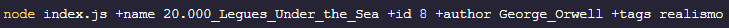

# PROYECTO INTEGRADOR MÓDULO 2

Esta app permite acceder a una base de datos que almacena libros, para realizar distintas peticiones de información según los parámetros que ingresemos por consola.  
Con ella damos cierre al módulo 2 de la carrera de Desarrollo web Back-end dictada en _Ada ITW_ por el profesor _Tomás Arno_ para la comisión _17va_.

**<u> QUE CONTIENE EL PROYECTO </u>**

Una carpeta `assets` que contiene este archivo <u>**README.md**</u>, imagenes y recursos.

Una carpeta `books` que contiene al archivo <u>**books.js**</u> quien exporta las siguientes funciones que actuaran como buscadores de información:

- **getAll()** _Devuelve el nombre de todos los libros._
- **getById(id)** _Devuelve el libro segun su ID._
- **getByName(name)** _Devuelve el libro según su nombre._
- **getByAuthor(author)** _Devuelve todos los libros del autor._
- **getByTag(tag)** _Devuelve los libros categorizados con esa etiqueta._
- **getSoldByAuthor(author)** _Devuelve el total de libros vendidos por el autor._

Una carpeta `db` que contiene el archivo <u>**db.js**</u> que representa a la base de datos y contiene una collection de libros con el siguiente formato:

- const dbBooks = [  
   {  
   id: 0,  
   name: 'Demian',  
   author: 'Herman Hesse',  
   tags: ['Drama', 'Historia', 'Psicologia'],  
   sold: 30000000  
   } ...  
  ]

Una carpeta `functions` que contiene las funciones principales, en este caso el archivo <u>**functionProcessArgv.js**</u> que exporta una función para procesar los argumentos recibidos por la consola.

Por ultimo una carpeta `src` que contiene el archivo <u>**index.js**</u> que ejecuta a la función **_main()_** quien a su vez, es encargada de ejecutar todas las demas funciones.

## Para ejecutar esta app desde la consola, sigue estos pasos:

1- Ejecuta el archivo principal _index.js_ desde la consola utilizando _Node.js_.

2- Los buscadores funcionaran pasando los siguientes argumentos:

- **id**: ID del libro que deseas buscar.
- **name**: Nombre del libro que deseas buscar.
- **author**: Nombre del autor cuyos libros deseas buscar.
- **tags**: Etiqueta del libro que deseas buscar.

NOTA: Es importante seguir la siguiente estructura a la hora de ingresar los argumentos en consola:  
`node index.js +propiedad valor +propiedad valor +propiedad valor +propiedad valor ...`

- Anteponer a la propiedad el simbolo "+"
- Utilizar el simbolo "\_" para definir los espacios

Por ejemplo:

3- Todas las funciones se ejecutaran al mismo tiempo desde main(), sin embargo puedes pasar la cantidad de parámetros que desees, ya que solo
devolverá los resultados de la búsqueda solicitada.
Si no enviamos ningun parametro de búsqueda, devolverá todos los libros.  

**NOTA**: Si ingresas una nueva propiedad que no esta dentro de las válidas para la búsqueda, por ejemplo "+apellido", la consola arrojará un error: **ERROR: LA PROPIEDAD ES INEXISTENTE**

¡Pongamoslo en marcha! 🤩
